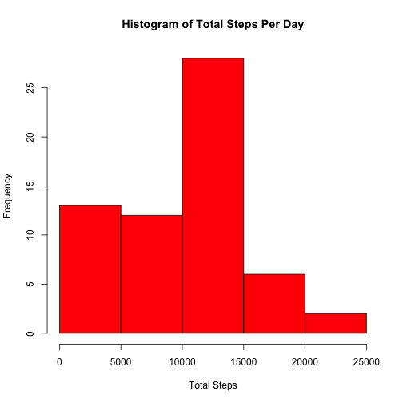
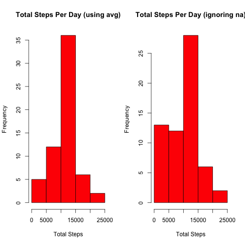
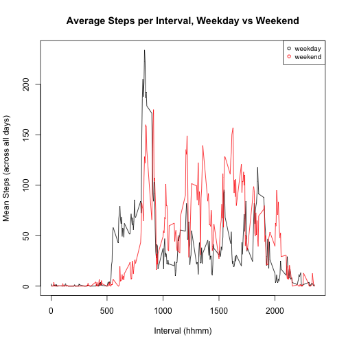

## Introduction

It is now possible to collect a large amount of data about personal
movement using activity monitoring devices such as a
[Fitbit](http://www.fitbit.com), [Nike
Fuelband](http://www.nike.com/us/en_us/c/nikeplus-fuelband), or
[Jawbone Up](https://jawbone.com/up). These type of devices are part of
the "quantified self" movement -- a group of enthusiasts who take
measurements about themselves regularly to improve their health, to
find patterns in their behavior, or because they are tech geeks. But
these data remain under-utilized both because the raw data are hard to
obtain and there is a lack of statistical methods and software for
processing and interpreting the data.

This assignment makes use of data from a personal activity monitoring
device. This device collects data at 5 minute intervals through out the
day. The data consists of two months of data from an anonymous
individual collected during the months of October and November, 2012
and include the number of steps taken in 5 minute intervals each day.

## Data

The data for this assignment can be downloaded from the course web
site:

* Dataset: [Activity monitoring data](https://d396qusza40orc.cloudfront.net/repdata%2Fdata%2Factivity.zip) [52K]

The variables included in this dataset are:

* **steps**: Number of steps taking in a 5-minute interval (missing
values are coded as `NA`)

* **date**: The date on which the measurement was taken in YYYY-MM-DD
format

* **interval**: Identifier for the 5-minute interval in which
measurement was taken

The dataset is stored in a comma-separated-value (CSV) file and there
are a total of 17,568 observations in this
dataset.

## Loading and preprocessing the data

In this step, we simply unzip the included `activity.zip` file and read it into the variable `data` using the following script:


```r
unzip("activity.zip")
data <- read.csv("activity.csv")
```

and then look at a summary of the data we've imported:


```r
summary(data)
```

```
##      steps               date          interval   
##  Min.   :  0.0   2012-10-01:  288   Min.   :   0  
##  1st Qu.:  0.0   2012-10-02:  288   1st Qu.: 589  
##  Median :  0.0   2012-10-03:  288   Median :1178  
##  Mean   : 37.4   2012-10-04:  288   Mean   :1178  
##  3rd Qu.: 12.0   2012-10-05:  288   3rd Qu.:1766  
##  Max.   :806.0   2012-10-06:  288   Max.   :2355  
##  NA's   :2304    (Other)   :15840
```

## What is mean total number of steps taken per day?

From the above summary, we can see that there are 288 rows per date, since the data was recorded at 5 minute intervals. In order to tell the mean per day, we'll need to first transform the data. 

In this step, we'll combine the data for each date by summing steps per date, leaving `NA` values out, and dropping the interval column. We'll use the `dplyr` package to perform this transformation.


```r
library(dplyr)
```


```r
data.by.day <- data %.% 
    group_by(date) %.% 
    summarize(steps=sum(steps, na.rm = TRUE))
```

We'll first take a look at a histogram to get some idea of where the mean may lie:


```r
hist(data.by.day$steps, freq=TRUE, xlab = "Total Steps", ylab="Frequency", main="Histogram of Total Steps Per Day", col="red")
```

 

And then run a summary of the data to inspect further:


```r
summary(data.by.day)
```

```
##          date        steps      
##  2012-10-01: 1   Min.   :    0  
##  2012-10-02: 1   1st Qu.: 6778  
##  2012-10-03: 1   Median :10395  
##  2012-10-04: 1   Mean   : 9354  
##  2012-10-05: 1   3rd Qu.:12811  
##  2012-10-06: 1   Max.   :21194  
##  (Other)   :55
```


We can see here by inspection that the mean number of steps per day is **9354** and the median is **10395**, and can also see that each of these matches nicely with what we could have inferred from the histogram.

## What is the average daily activity pattern?

To answer this question we'd like to make a time series plot with the 5-minute interval on the x-axis, and the average number of steps taken, averaged across all days, on the y-axis.

This means collapsing the `data` table on interval, rather than date, and seeing how it pans out.  Once again, we'll use `dplyr` here:


```r
data.by.interval <- data %.% 
    group_by(interval) %.% 
    summarize(steps=mean(steps, na.rm = TRUE))
plot(data.by.interval$interval, 
     data.by.interval$steps, 
     type="l",
     xlab="Interval (hhmm)",
     ylab="Mean Steps (across all days)",
     main="Average Steps per Interval")
```

 

To determine which 5-minute interval, on average across all the days in the dataset, contains the maximum number of steps, we'll inspect the data further.

The interval which contains the most steps on average is:

```r
data.by.interval[data.by.interval$steps==max(data.by.interval$steps),]$interval
```

```
## [1] 835
```

and the corresponding average number of steps is:

```r
floor(data.by.interval[data.by.interval$steps==max(data.by.interval$steps),]$steps)
```

```
## [1] 206
```

## Imputing missing values

First we'll calculate and report the total number of missing values in the original dataset (i.e. the total number of rows with NAs):


```r
nrow(data[!complete.cases(data),])
```

```
## [1] 2304
```

Next, we will test the effects of using the mean/median for the corresponding 5-minute interval to fill the na values that set.

We'll do this by creating a new dataset that is equal to the original dataset but with the missing data filled in:


```r
data.filled <- data
data.filled <- merge(data.filled, data.by.interval, by="interval", suffixes = c("", ".avg"))
data.filled[is.na(data.filled$steps),]$steps <- data.filled[is.na(data.filled$steps),]$steps.avg
```

We now want to make a histogram of the total number of steps taken each day and calculate and report the mean and median total number of steps taken per day, in order to see whether these values differ from the estimates from the first part of the assignment. The goal here is to assess the impact of imputing missing data on the estimates of the total daily number of steps.


```r
data.filled.by.day <- data.filled %.% 
    group_by(date) %.% 
    summarize(steps=sum(steps, na.rm = TRUE))
par(mfrow=c(1,2))
hist(data.filled.by.day$steps, freq=TRUE, xlab = "Total Steps", ylab="Frequency", main="Total Steps Per Day (using avg)", col="red")
hist(data.by.day$steps, freq=TRUE, xlab = "Total Steps", ylab="Frequency", main="Total Steps Per Day (ignoring na)", col="red")
```

 

We'll also take a look at the summary of this data:


```r
summary(data.by.day$steps)
```

```
##    Min. 1st Qu.  Median    Mean 3rd Qu.    Max. 
##       0    6780   10400    9350   12800   21200
```


We can see here by inspection that the mean number of steps per day is now **10766** where before it was **9354**. The median is now **10766**, where before it was **10395**.

As we can see, this method of imputing data had a significant effect in changing the mean and median (further investigation beyond this assignment is needed to say why this is concusively), as well as changing the overall distribution. Ideally, the replacement values would not only count on the average for that interval, but would also be weighted by the day's average to account for variance across days.

## Are there differences in activity patterns between weekdays and weekends?

To explore this question, we'll first create a new factor variable in the dataset with two levels – “weekday” and “weekend” indicating whether a given date is a weekday or weekend day.


```r
data$day.of.week <- weekdays(as.Date(data$date))
data$day.type <- factor(ifelse(data$day.of.week == "Sunday" | data$day.of.week == "Saturday", "weekend", "weekday"))
```

Next we'll make a panel plot similar to the one we made previsouly, containing a time series plot (i.e. type = "l") of the 5-minute interval (x-axis) and the average number of steps taken, averaged across all weekday days or weekend days (y-axis).


```r
data.with.day.of.week.by.interval <- data %.% 
    group_by(interval, day.type) %.% 
    summarize(steps=mean(steps, na.rm = TRUE))
par(mfrow=c(1,1))
plot(data.with.day.of.week.by.interval[data.with.day.of.week.by.interval$day.typ =="weekday",]$interval, 
     data.with.day.of.week.by.interval[data.with.day.of.week.by.interval$day.typ =="weekday",]$steps, 
     type="l",
     xlab="Interval (hhmm)",
     ylab="Mean Steps (across all days)",
     main="Average Steps per Interval, Weekday vs Weekend",
     col="black")
lines(data.with.day.of.week.by.interval[data.with.day.of.week.by.interval$day.typ =="weekend",]$interval, 
     data.with.day.of.week.by.interval[data.with.day.of.week.by.interval$day.typ =="weekend",]$steps, 
     type="l",
     col="red")
legend('topright', legend = levels(data.with.day.of.week.by.interval$day.type), col = 1:3, cex = 0.8, pch = 1)
```

 

From the chart, there are some clear differences in weekday patterns vs weekends. Weekdays have a higher volume of steps starting earlier in the morning, and then drop off relative to weekends during the day, then spike back up toward the end of the day.  Weekend steps volume also continues later into the evening.  Presumably, the weekday pattern is due to "rush hour" foot traffic and not going out in the evenings as frequently as on weekends, but further investigation would be necessary to determine this conclusively.

## What does the running average of steps over the data collection process look like?

While this was not part of the assignment, it is somewhat interesting to inspect, and since I've accidentally done the work for it I'll include it here as a footnote.

In order to do this chart we need to perform three minor transformations:

* create an absolute interval column that combines date and interval into a datetime using `lubridate` library
* exclude `NA` values in the steps column
* create a running average column


```r
library(lubridate)
```


```r
data$time.of.day <- sprintf("%04d",data$interval)
data$time.of.day <- paste(substr(data$time.of.day,0,2),":",substr(data$time.of.day,3,4),":","00", sep="")
data$abs.interval <- ymd_hms(paste(data$date, data$time.of.day))
data.without.na <- data[!is.na(data$steps),]
data.without.na$steps.running.avg <- cumsum(data.without.na$steps)/1:length(data.without.na$steps)
```

Now, we can plot:


```r
plot(data.without.na$abs.interval, data.without.na$steps.running.avg, type="l")
```

 
